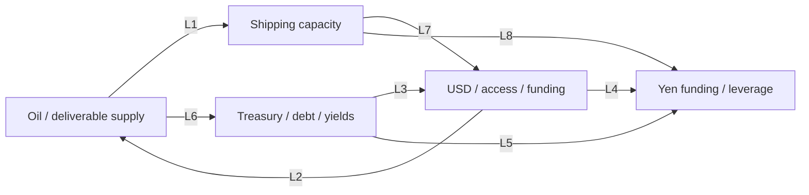

Status: RESEARCH_ONLY_NOT_RUNTIME_KNOWLEDGE

# Alpha Macro Research — Batch 1 synthesis

研究及来源核查日期：**2026-09-20，America/New_York**。执行者：Codex/Alpha；这是同一研究者的整理及反证自审，**不是独立审稿，也不是Owner批准**。状态：五份档案完成本批研究与自审，提交Owner/ChatGPT review；所有未知项继续保留。

本批仅保存研究文件。没有接入运行时知识目录、新闻分类、Daily guidance、Candidate checks、Trade planner或Position watch；没有建立观察器、策略、数据服务或后续自动任务。指标是研究建议，箭头不是交易信号。原15:50自然采集与首次真实定向报价仍是各自独立的等待事项，本批未执行或改变其验收。

## 1. Dossier index and answers

| Dossier | 本批回答的核心问题 | 结论边界 |
|---|---|---|
| [M01 Oil Is Power](M01_OIL_IS_POWER.md) | 权力分散在产量、可用产能、运输、库存、融资与政策反应；配额影响力不是对价格的完全控制 | EIA产能定义已变；油→通胀→利率→资产每段都有反作用 |
| [M02 Dollar and sanctions](M02_DOLLAR_AND_SANCTIONS.md) | 储备、计价、融资、报文与结算互相强化，但法律控制点和替代成本不同 | SWIFT不是美元；储备份额不是资金流；冻结、拒付与没收分开 |
| [M03 Debt and fiscal dominance](M03_DEBT_AND_FISCAL_DOMINANCE.md) | 需要跟踪净融资、期限、实际付息和政策约束，才能把债务存量连接到市场 | 财政主导是需识别的制度机制；本批没有证实美国当前已处其中 |
| [M04 Yen carry](M04_YEN_CARRY_TRADE.md) | 未对冲日元融资承担汇率、资产和保证金风险；机构对冲投资不等于投机carry | 当前全球净敞口和正在unwind均UNKNOWN；不能用股跌加日元涨代替仓位证据 |
| [M05 Shipping chokepoints](M05_GLOBAL_SHIPPING_CHOKEPOINTS.md) | 货物类型、起终点、替代路径、水文和保险决定瓶颈效果 | 不能把通道份额相加、把船舶吨位当货重、把部分恢复当全面安全 |

每份包含A–M要求和N自审说明；各有历史节点、参与者归属、流量/存量边界、替代解释、当前资料日期、少量观察指标、Alpha相关渠道与来源地图。完成表示可供审阅，不表示全部未知已解决或研究具有收益优势。

## 2. Shared actors

| Actor / 不合并的职责 | 跨主题角色 | 可核证据与不可推定部分 |
|---|---|---|
| 美国财政决策者 / Treasury / OFAC | 税支出和发债；制裁和资本准入；能源安全安排 | M02 D/S06–S07；M03 D/S01–S03。法律、融资量和隐藏政策动机不同 |
| Fed及合作央行 | 短端货币条件、央行资产负债表、美元后备流动性 | M02 S08、M03 S04/S07。制度能力不证明已提款或财政主导 |
| BOJ / MOF / 日本机构投资者 | 国内利率、跨境证券统计、对冲与外币资产 | M04 D。政府、央行、保险公司、杠杆基金不能合成一个“日本资金”主体 |
| 沙特、俄罗斯、其他生产国及美国分散生产商 | 实物供给、财政/外汇收入、投资与协调 | M01 D。合作目标不等于履约；低成本不等于即时可出口能力 |
| 银行、FX dealers、经纪及清算机构 | 币种融资、代理行、抵押品、margin与资本约束 | M02 D、M04 D。中介风险控制可能放大市场压力，但需交易证据 |
| 运河/沿岸当局、船东、货主、船员与保险机构 | 运输能力、实际通过、承保及营运资金 | M05 D。运费/保费收入、成本、损失与安全不可用一个利益方向描述 |
| 储备管理者、长期基金与最终消费者 | 资产配置、负债匹配、实际购买力 | M01/M02/M03 D。持有数量、估值和支付流量分开；同国家居民也有利益冲突 |

涉及结构性激励的文字是 MODEL_INFERENCE / **ALPHA_INFERENCE**，不是国家真实意图鉴定。共同反例是安全、法律、负债匹配或政治约束主导，须回到各档案D/F的证伪条件。

## 3. Shared flows and accounting boundaries

| Flow / endpoints | 主要机制 | 已知证据层 | 不能替代它的数字 |
|---|---|---|---|
| 生产商→炼厂→最终用户；能源 | 油井、管道、海运、库存释放 | M01 E与M05 E的历史产出/季度运输估计 | 配额公告、备用产能和SPR库存不是已交付桶数 |
| 付款银行→代理行/清算系统→收款银行；USD | 银行账务与清算、报文支持 | M02 E，制度和运营事实；当期净流量未测 | SWIFT消息条数不等于资本流入；CHIPS总额不是国际贸易额 |
| 投资者→Treasury；净融资 | 初级发行扣除到期及口径调整 | M03 E：财政报告中的2026Q2实际与Q3/Q4预计分别标记 | 总拍卖、gross debt、public debt、年度赤字不能互换 |
| 银行/对手→投资者→外币资产；融资 | 贷款、FX swaps或未对冲carry | M04 E：机制、有日期的历史估算；当前总量UNKNOWN | 名义衍生金额、日本海外证券净卖出不是全球carry平仓额 |
| 船东/货主→燃油/保险/港口等；费用 | 航行、风险转移、通行及等待 | M05 E：方向性成本机制；本批未取得逐项现实净支付 | 保费报价不是净利润，货值不是运费，吨海里不是货重 |
| Fed→合作央行→合格机构；后备美元 | 常设互换及转贷 | M02/M04 E：授权制度，当前使用量UNKNOWN | 常设额度不等于资金已经进入股票/加密市场 |

**禁止跨层求和：**一桶油可以经过多个咽喉，一笔美元可能经过多个支付步骤，一组衍生交易可以有多个对手。同一上游的多个报道不产生更多独立流量。估值变化、公告能力、资产存量和实际期间流量必须分栏。

## 4. Cross-theme causal map

这是研究关联图，非自动推理规则。边的含义、级别、时域和反力以表为准；双向影响不意味着固定相关系数。

| ID / themes | Mechanism and exact dossier section | Evidence status | Horizon | Counterforce / what weakens it |
|---|---|---|---|---|
| L1 M01↔M05 | 实物出口的可交付性依赖航路/有限旁路；[M01 E](M01_OIL_IS_POWER.md#e-flows)、[M05 A/E](M05_GLOBAL_SHIPPING_CHOKEPOINTS.md#e-flows)，共同EIA来源 | FACTUAL_DEPENDENCY | 小时至月；新设施更久 | 库存、替代供应/路线；船只改道不必然少产油 |
| L2 M02→M01 | 支付、融资与金融准入改变贸易成本；[M02 F](M02_DOLLAR_AND_SANCTIONS.md#f-causal-mechanisms)、[M01 F](M01_OIL_IS_POWER.md#f-causal-mechanisms) | SUPPORTED_MECHANISM | 日至季 | 许可、替代中介及客户；需区分桶数减少与折价/回款变慢 |
| L3 M03↔M02 | 美债提供美元储备/抵押资产，美元网络支持需求；[M03 J](M03_DEBT_AND_FISCAL_DOMINANCE.md#j-cross-theme-links)、[M02 A/J](M02_DOLLAR_AND_SANCTIONS.md#j-cross-theme-links) | FACTUAL_DEPENDENCY，边际价格反应CONDITIONAL | 日至多年 | 替代资产、国内吸收、制度风险；安全资产供给不表示可无限无成本融资 |
| L4 M02↔M04 | FX swaps和美元后备连接融资币种；[M04 E/F](M04_YEN_CARRY_TRADE.md#f-causal-mechanisms)，BIS/Fed机制 | SUPPORTED_MECHANISM | 小时至季 | hedging、basis与央行后备；不识别全部净杠杆 |
| L5 M03↔M04 | 债券收益、期限及hedge成本改变日本投资者配置；[M03 J](M03_DEBT_AND_FISCAL_DOMINANCE.md#j-cross-theme-links)、[M04 F](M04_YEN_CARRY_TRADE.md#f-causal-mechanisms) | SUPPORTED_MECHANISM | 日至季 | 负债匹配、汇率对冲、市场已计价；政策利差不足以测真实回报 |
| L6 M01→M03 | 能源通胀/增长冲击影响政策、税收和再融资成本；[M01 F](M01_OIL_IS_POWER.md#f-causal-mechanisms)、[M03 F](M03_DEBT_AND_FISCAL_DOMINANCE.md#f-causal-mechanisms) | CONDITIONAL_HYPOTHESIS / ALPHA_INFERENCE | 周至多年 | 需求下降、锚定预期、锁定旧利率、财政调整；无自动加息或主导结论 |
| L7 M05↔M02 | 延迟交付增加营运资金需求，准入约束反过来影响承保/结算；[M05 F/J](M05_GLOBAL_SHIPPING_CHOKEPOINTS.md#f-causal-mechanisms) | CONDITIONAL_HYPOTHESIS / ALPHA_INFERENCE | 日至季 | 库存、合约与替代融资；本批无实际授信变化，不能当已发生美元短缺 |
| L8 M05→M04 | 日本进口与风险情绪可能改变政策/融资预期；[M04 J](M04_YEN_CARRY_TRADE.md#j-cross-theme-links)、[M05 J](M05_GLOBAL_SHIPPING_CHOKEPOINTS.md#j-cross-theme-links) | CONDITIONAL_HYPOTHESIS / ALPHA_INFERENCE | 周至季 | 利率已计价、出口收入与对冲；没有航运→当前carry卖出的直接量化证据 |

L6–L8共同反证要求：若中间变量（成本、融资、政策或净仓位）未改变，而资产仅同向移动，则该链条不获确认。替代解释包括增长/需求消息、国内政策或资产自身供需。没有给边分配概率、权重或触发阈值。

## 5. Common market transmission

市场渠道来自各档案F/K，均保留反方向。**ALPHA_INFERENCE**：判读时至少分“实物是否变了、融资条件是否变了、市场之前预期了什么”；本批没有建立预期数据集，因此不宣称找到预期差或交易优势。

| Channel | 可能作用 | 最重要的反例 / 确認所需 |
|---|---|---|
| Inflation | 能源直接项、运费间接项、汇率和预期扩散 | 一次价格水平变化不同于持续通胀；需求与利润吸收可抵消，需下游数据 |
| Rates | 预期短率、期限溢价、通胀补偿和流动性共同变化 | 长债升息不必是加息预期；名义与实际必须同期限、含测量限制 |
| USD | 结算/负债需求、储备选择、安全资产/避险 | 美国自身增长及制度风险可反向；COFER份额不能代替资金市场 |
| Liquidity / risk appetite | 保证金、repo、FX资金和信用条件影响资产出售 | 无杠杆机构和后备流动性可缓冲；共跌不足识别具体资金链 |
| Gold / GLD | 实际利率、风险需求、托管偏好与现金筹措 | 央行实物黄金、黄金价格和GLD申赎不同；没有固定“战争买黄金”规则 |
| BTC / IBIT | 美元融资、杠杆与风险预算的间接作用 | 加密自身供需/监管/ETF流量重要；直接日元融资或航运因果仍UNKNOWN |

价格方向、资金流、因果解释和可执行交易是四个不同结论。本研究只到机制与证据边界，不计算期权回报、不引用当下合约、不生成交易许可。

## 6. Highest-value watch questions

不是自动监控清单，不新增任何数据调用。详细频率、滞后和来源见各档案I。

1. **实物供给还是新闻？**配额与实际产出/装运、可用库存是否同步变化；油的品级和交付地点是否匹配？
2. **储备配置还是估值？**COFER汇率/方法、数量变化与黄金价格效应是否分开？
3. **债务负担怎样传到市场？**净融资、现金余额、期限及实际再融资成本；与模型期限溢价互相检查。
4. **carry真的在退吗？**可观察日元头寸、融资/basis、保证金与跨资产去风险能否共同支持，而非只看汇率？
5. **运输真的恢复吗？**按货类的通行、改道时长、承保和目的地到货是否一致；Panama公告是否已落实？
6. **宏观压力到哪里为止？**能源以外的价格、工资/预期、信贷与行业利润是否出现预期传导？没有就停止延伸故事。

## 7. Adversarial review and corrections

逐份核对官方说法/结果、隐藏动机、相关/因果、历史/当前、反例、上游重复、引用支持、主体异质、叙事/流量、GLD/IBIT方向十一类问题。下列是实际发现并修订/保留的事项，不是独立审阅认证。

| Dossier | 修正或重要限制 | 保留的反例 |
|---|---|---|
| M01 | 更新EIA产能时间口径；当前OPEC公告只指实际七国；SPR存量不当本次释放；旧Brent篮子不作现行规格 | 需求下降、非OPEC响应、炼厂/物流瓶颈可抵消或改变油价冲击 |
| M02 | 分开报文/清算、blocking/拒付/没收；COFER存量份额不是净抛售；黄金市值效应与数量分开 | 网络流动性、许可与替代中介；单个储备指标不能宣布美元崩溃 |
| M03 | public debt包含Fed；季度融资不是年度赤字；Treasury回购不是QE或净减债；名实利差非纯通胀预期 | 财政紧缩、自愿安全资产需求、衰退降息均不等于财政主导 |
| M04 | 09-18 BOJ公告与09-24新目标/便利实施分开；历史carry估计不作2026仓位；CFTC/MOF覆盖限制明确 | 对冲/负债匹配、美国增长消息及2024迅速稳定 |
| M05 | PC/UMS/净吨位不作货重；Suez含管道口径标明；2025Q4 Malacca两表冲突保留；部分回流不是全面安全 | 需求下降、闲置船/替代路线、保险损失；不同期间的恢复与限载可同时为真 |

**没有把来源层级当真理保证。**EIA官方报告同页也可能有冲突；运河经营者同时是数据发布者和商业利益方；央行工作人员研究不等于央行政策决定；BIS/Fed转引同一上游不算独立重复验证。发布日期未知、全文不可读取、PDF表格无法可靠对齐之处都降低对应主张范围。

## 8. Source coverage and remaining gaps

五份档案的M节共列 **54个不同的公开URL**；这是参考入口数量，**不是54份全文已读，更不是54个独立观测**。覆盖OPEC、EIA/DOE、Fed/NYFed、Treasury/OFAC/CBO、IMF、BIS、BOJ/MOF、CFTC、SWIFT/CHIPS、IMO、SCA/ACP与UNCTAD。以官方事实/制度与机构研究为主；没有为数量加入媒体或政治评论。

实际阅读粒度逐源记录：HTML正文或明确段落、PDF可读文字、摘要、官方索引节选，或获取失败。当前结构使用本次公开读取及来源自身日期，不能用抓取日期冒充统计更新日期。

| Gap | 影响范围 | 下一次审阅需要的专业证据；本批不启动 |
|---|---|---|
| EIA Malacca 2025Q4 Table2/3：24.9 vs24.0 | 该季度比较和衍生份额不能选择性使用 | 发布方修订/方法说明；现阶段保留冲突 |
| 当前carry净杠杆及具体目标资产 | 无法量化2026全球unwind或归因IBIT变化 | 融资币种、对冲、持仓与margin的专业微观资料，公开代理指标也不完整 |
| 当前财政主导识别 | 高债务与融资安排不够识别regime | 具体制度约束、决策反事实、多模型与强制配置证据 |
| 具体制裁适用与实际绕行规模 | 不能从法规得出贸易完全隔绝或政策成功 | 法律专业复核、执行/许可、相匹配贸易与银行资料 |
| 当前可出口备用产能及逐航线成本 | 不能据名义产能/保费推算实物或利润 | 工程/港口/保险/企业暴露数据；不以购买服务补齐本批 |
| 部分页面不能完整读取 | IMF金融抑制全文/Fiscal Data正文403；UNCTAD正文/PDF失败；MOF图表列对齐不足 | 明确降为摘要、节选或缺数据；不假装通读、不从记忆补数 |
| 多个当前机构网页发布日期缺失 | 可说明读到的制度/公告，不能假定今日更新 | 需原始带日期公告或稳定版本；M节标UNKNOWN，不自行填日期 |
| GLD/IBIT的系数与交易适用 | 机制研究未证明特定时间/合约的优势 | 本阶段不研究收益/阈值；需要下一阶段明确授权与独立证据 |

## 9. Usage, storage and validation boundary

本批公开研究工具实际计数（含失败及重复定位，不算独立来源）：**21次web工具调用，34条搜索查询，56次页面/文档open、6次链接click，共62次打开尝试；40次页内find；5次PDF截图尝试**。截图结果未提供可核视觉内容，因此未用它们为表格数值背书。公开网页工具底层实际HTTP请求数不可见，UNKNOWN，不能用上述操作数假装网络包数。

应用内Host生成/模型服务接口调用 **0**；没有调用Alpha分析接收器或改变已存计划。研究文本由本次Codex会话生成；会话内部生成/推理分段及计费token未获得账单，不能把它们称为零成本。新增直接外部业务API调用 **0**；市场/券商调用 **0**。Git远端读取/普通push用于保存文件，与行情和研究来源调用分开。

存储：仅本目录 **6份Markdown**；保存URL、元数据、转述、短必要表格事实及推断，不存完整版权正文、私有运行日志、账户或凭据；没有数据库、依赖、采集/调度或产品代码变化。实际字节数在最终交付按文件统计，不以字节量衡量研究价值。

**USD COST UNKNOWN**：没有账单证据；匿名公开读取不等于整体免费。没有新订阅、采购或付费服务授权使用。

本次在六份文件上复用 `scripts/alpha-validate.mjs` 的 `checkMarkdown` 和 `checkSecrets`，未运行该脚本的全量产品入口。另做一次性结构/引用检查：五份A–N节齐全，各7–9个历史节点、6–7项指标，源ID均可对应M节，34个跨文件锚点有效；结果零失败。Git工作区与暂存区diff检查另行完成。没有此目录专用的既有研究schema；未新增校验框架、JSON或YAML。检查只验证文件结构和引用连接，不机器认证语义。产品代码未改，不重跑全量产品测试，也不引用历史测试数量作本批证据。

## 10. Review handoff

下一步只有 **Owner/ChatGPT审阅本批来源支持度、口径边界和反证质量**。原始问题得到了可追溯的机制答案；数值、意图和因果识别的未知项保持未知。不开始Batch2，不将这些文档转为runtime knowledge、策略、signal或recommendation。
